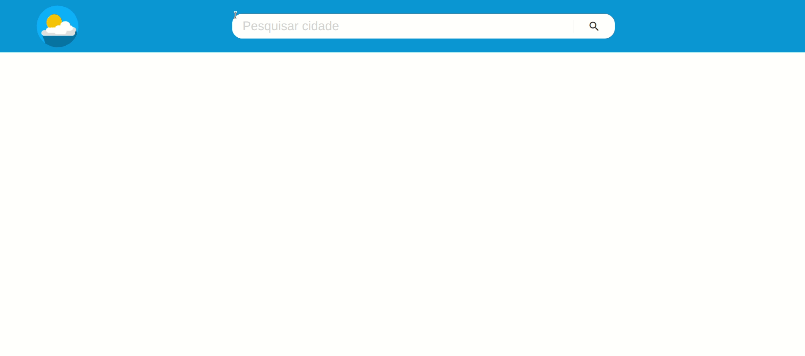

# iChoveu - Previsão do Tempo ☁️🌡️
Este é um projeto de um site de previsão do tempo que consome dados diretamente da API do [WeatherAPI](https://www.weatherapi.com/docs/).

##  Configuração da Chave da API
Para utilizar este projeto, é necessário criar uma conta no WeatherAPI e gerar uma chave de API. Para isso, siga os passos abaixo:

1. Acesse [WeatherAPI](https://www.weatherapi.com/) e crie sua conta.
2. Clique no botão "Copy" para copiar a chave da API.
3. Crie um arquivo `.env` na raiz do projeto e adicione a chave da API copiada conforme o exemplo: `VITE_TOKEN=SEU_TOKEN_AQUI`
4. O token fica acessível por meio do objeto `import.meta.env.VITE_TOKEN` dentro do código.

## 💡 Funcionalidades Implementadas
- **searchCities**: Função que retorna uma lista de cidades correspondentes ao termo de busca. Foi utilizado o endpoint de pesquisa de cidades da API.

-  **getWeatherByCity**: Função que retorna o tempo atual de cada cidade a partir da URL da cidade obtida na requisição de pesquisa de cidades.

-  **handleSearch**: Função que lida com o evento de submit do formulário de busca. Esse método adiciona cada elemento criado como filho do elemento `<ul id="cities">`, representando as cidades retornadas pela API.

-  **createCityElement**: Esta função foi modificada para criar um botão "Ver previsão" para cada cidade retornada pela API. O botão contém um evento de clique que, ao ser acionado, realiza a requisição da previsão de 7 dias da cidade, exibindo-a na tela dentro de um modal usando a função `showForecast`.

- **getForecastByCity**: Função que retorna as informações da previsão do tempo para 7 dias a partir da URL da cidade.

## 💻 Visualize este projeto:

## ℹ️ Considerações finais
Este projeto é apenas para fins educacionais. Qualquer dúvida ou sugestão, sinta-se à vontade para entrar em contato.
